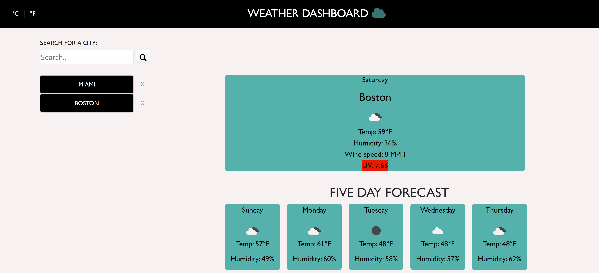

# WeatherDashborad

WeatherDashboard is an app that allows a user to see current weather and 5-day forecast at their location or for the city they search for. Each city that users search's for gets added to dynamically created list. 

* Technologies used to build an app:

- Bootstrap for CSS grid and components
- jQuery  for building app functionality
- Third Party API - OpenWeather API to get weather forecast, HTML5 Geolocation API for user's location
- AJAX to hook into the API to retrieve data in JSON format
- Localstorage to store persistent data

